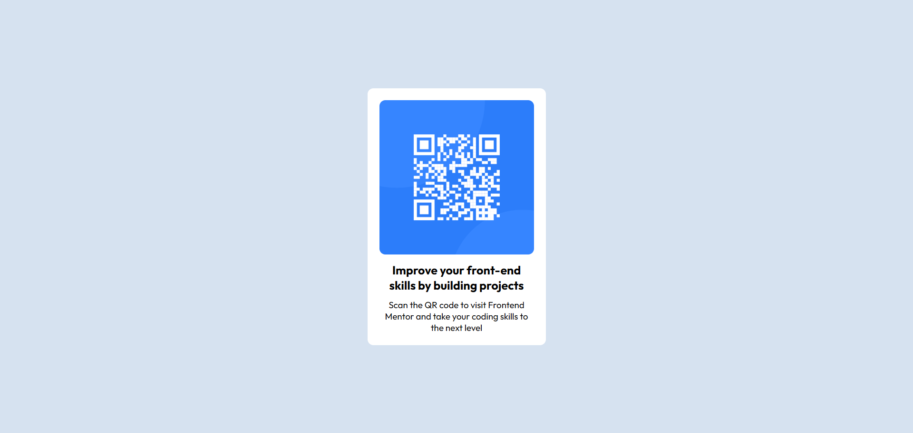

# Frontend Mentor - QR code component solution

This is a solution to the [QR code component challenge on Frontend Mentor](https://www.frontendmentor.io/challenges/qr-code-component-iux_sIO_H). Frontend Mentor challenges help you improve your coding skills by building realistic projects. 

## Table of contents

- [Frontend Mentor - QR code component solution](#frontend-mentor---qr-code-component-solution)
  - [Table of contents](#table-of-contents)
  - [Overview](#overview)
    - [Screenshot](#screenshot)
    - [Links](#links)
  - [My process](#my-process)
    - [Built with](#built-with)
    - [What I learned](#what-i-learned)
    - [Continued development](#continued-development)
    - [Useful resources](#useful-resources)
    - [AI Collaboration](#ai-collaboration)
  - [Author](#author)
  - [Acknowledgments](#acknowledgments)

## Overview

### Screenshot



### Links

- Solution URL: [Add solution URL here](https://your-solution-url.com)
- Live Site URL: [Add live site URL here](https://your-live-site-url.com)

## My process

### Built with

- Semantic HTML5 markup
- CSS custom properties

### What I learned

Through this project, I improved:

- Writing clean and semantic HTML structure
- Using Flexbox for centering layouts
- Managing spacing and alignment properly
- Improving attention to UI details
- Understanding the importance of small design refinements

Example of a clean structure I focused on:

```html
<!doctype html>
<html lang="en">
  <head>
    <meta charset="UTF-8" />
    <meta name="viewport" content="width=device-width, initial-scale=1.0" />
    <title>QR code component solution</title>
    <link rel="stylesheet" href="styles.css" />
    <link
      rel="shortcut icon"
      href="imgs/favicon-32x32.png"
      type="image/x-icon"
    />
    <link rel="preconnect" href="https://fonts.googleapis.com" />
    <link rel="preconnect" href="https://fonts.gstatic.com" crossorigin />
    <link
      href="https://fonts.googleapis.com/css2?family=Outfit:wght@100..900&display=swap"
      rel="stylesheet"
    />
  </head>
  <body>
    <div class="component">
      
      <h1>Improve your front-end skills by building projects</h1>
      <p>
        Scan the QR code to visit Frontend Mentor and take your coding skills to
        the next level
      </p>
    </div>
  </body>
</html>

```
```css
* {
    margin: 0;
    padding: 0;
    box-sizing: border-box;
    font-family: 'Outfit', Arial, Helvetica, sans-serif;
}

body {
    display: flex;
    align-items: center;
    justify-content: center;
    background-color: hsl(212, 45%, 89%);
    height: 100vh;
}

.component {
    text-align: center;
    padding: 20px;
    width: 300px;
    background-color: white;
    border-radius: 10px;
}

img {
    max-width: 100%;
    border-radius: 10px;
}

h1 {
    font-size: 20px;
    margin: 10px 0;
}

p {
    font-size: 15px;
}
```

### Continued development

In future projects, I want to focus more on:

- Advanced CSS layouts
- UI/UX design principles
- Accessibility improvements
- Building larger real-world projects
- Mastering the MERN Stack

My goal is to become a professional Full-Stack Developer.

### Useful resources


- https://developer.mozilla.org/
  - Helped me understand semantic HTML and CSS properties clearly.

- https://css-tricks.com/
  - Great resource for mastering Flexbox and layout techniques.

- https://www.frontendmentor.io/
  - Best platform for practicing real-world frontend challenges.

### AI Collaboration

During this project, I used AI tools to:

- Review and improve README structure
- Refine project description wording
- Improve documentation clarity

AI helped me organize my ideas better and present my work professionally.

## Author

- Name - Mohamed Sokara
- Website - [MoSokara.github.io](https://mosokara.github.io/my_portfolio_webside/)
- Frontend Mentor - [@MoSokara](https://www.frontendmentor.io/profile/MoSokara)
- Twitter - [@Mo_Sokara](https://x.com/Mo_Sokara)

- GitHub - [@MoSokara](https://github.com/MoSokara)

- LinkedIn: [@mosokara](https://www.linkedin.com/in/mosokara)

## Acknowledgments

I want to give a special thanks to **Frontend Mentor** for providing this challenge and helping me improve my front-end skills.  

I also want to acknowledge the inspiration I got from studying other developers’ solutions and learning from their approaches.  

A big thank you to **myself** for staying consistent, practicing every day, and always aiming to improve my coding and design skills.  

Finally, gratitude to my family and friends for their support while I focus on learning and building projects.